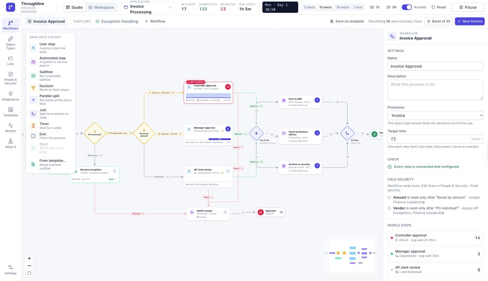
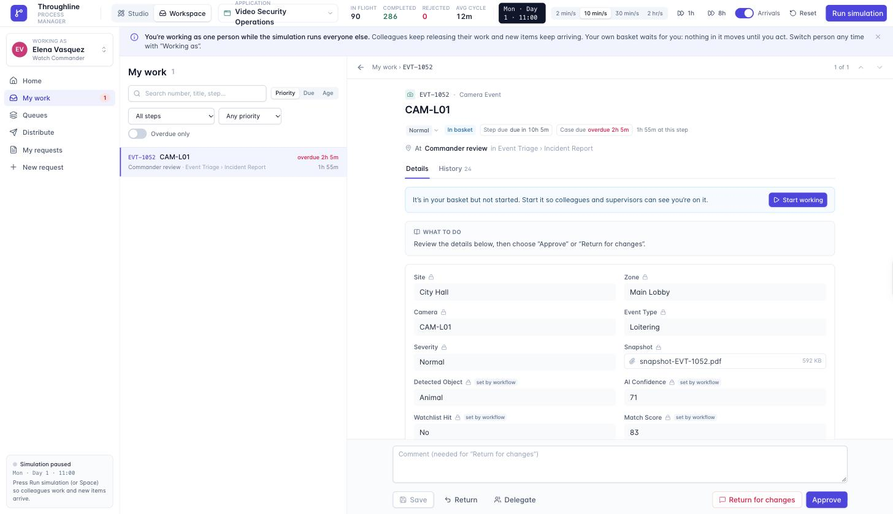
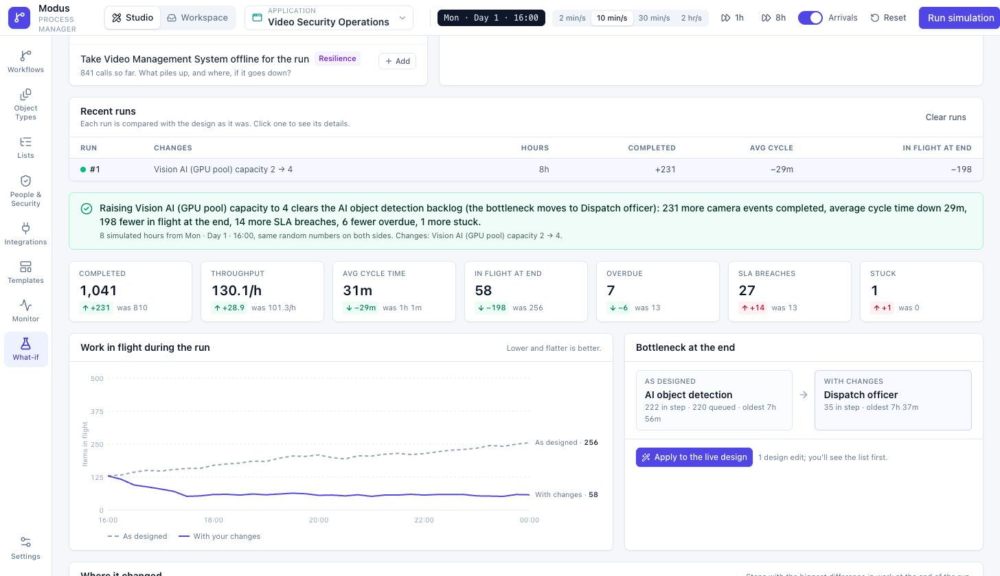
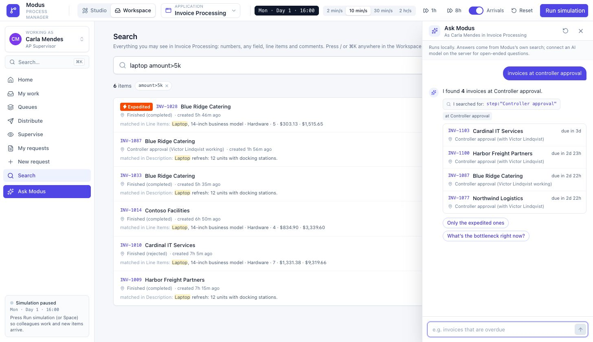
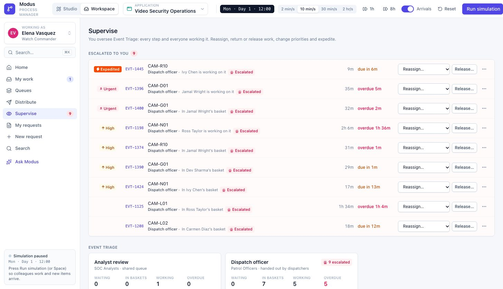
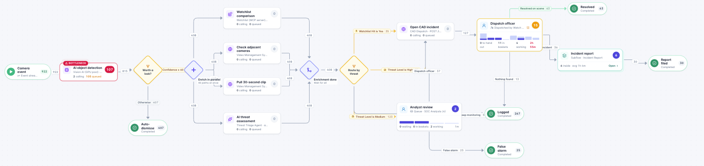

# Modus

*As in modus operandi: the way your organization gets things done.*

**An open-source process manager where the model is the system.** Draw a process, watch work
move through it, find the bottleneck, test a fix, and change it — on the same model that runs
the work.

<p>
  <a href="https://empowerment-ai.github.io/modus/"><b>Try the live demo</b></a> ·
  <a href="docs/DEMO.md">Demo script</a> ·
  <a href="docs/CONCEPTS.md">Concepts</a> ·
  <a href="docs/ARCHITECTURE.md">Architecture</a> ·
  <a href="docs/TECH-STACK.md">Tech stack</a> ·
  <a href="docs/DEPLOYMENT.md">Deploy</a> ·
  <a href="docs/ROADMAP.md">Roadmap</a>
</p>



Modus is for organizations whose work moves through people and systems: approvals,
requests, case work — and also processes that aren't "business" at all, like camera signals
screened by AI, enriched in parallel, and routed to the officer who should look. Business
people can read and change every step. Administrators see the whole picture: how many items
are at each step right now, where work piles up, who is overloaded, and what would happen if
they changed something.

> **Status: prototype.** The studio and the Workspace run entirely in the browser with a
> simulated organization. The server is a working skeleton that ships as one container image
> (in-memory storage for now). See the [roadmap](docs/ROADMAP.md).

## What it does

**Design**

- **Dynamic object types** with generated forms, **line items** (an invoice's lines with
  calculated totals), and **linked lists** (Model Year → Make → Model).
- A **visual workflow designer**: people steps, automated steps, decisions on field values and
  line items ("any line where Category is Software"), **parallel split / join** (all, first one
  wins, N of M), **subflows**, timers.
- **Templates**: save any workflow, stamp it into another application with a field mapping, or
  blow a single step out into its own subflow.
- **Drafts and versions**: change the map freely, then **publish** a new version for new items
  only, for items in flight too (choosing where work at removed steps goes), or for nobody yet.
  Every version is kept with a note, you can see which items run on which, and move them to the
  latest one at a time or all at once.

**Work**

- Five ways to hand out work: **load balanced**, **queue** (claim / get next), **distribution
  groups** (dispatchers hand each item out), **direct**, and **the person named on the item**.
- **Priorities and due dates**, escalation, reassign within a group, delegate, return — and
  **expedite**: flag an item to jump every queue with faster clocks and a fast lane, under a
  per-process policy.
- **Supervisors** for processes and for individual steps, plus **roles** (administrator,
  designer, auditor). Supervisors see everything at their steps and can reassign, release on
  behalf, re-prioritize, expedite and rebalance.
- An end-user **Workspace**: home dashboard, my basket, queues, a dispatch board, my requests,
  new request, the work form with field security applied, **search** across everything you may
  see (`is:overdue amount>10k vendor:acme`), and **Ask Modus**, a chat that answers questions
  about the work in plain words.

**Automate**

- A **service registry**: REST/OpenAPI, **MCP servers**, **worker pools** (registered services
  that poll for jobs), **AI agents**, email — each with capacity, status and typed outputs.
- Retries, a *Failed* path, or hand the work to a person; administrators can take work off an
  automated step at any time.

**Control**

- **Live counts and bottlenecks** on the map, including automated steps that run out of capacity.
- **What-if lab**: copy the live state, change staffing, handling time, arrivals, distribution
  or capacity, run both forward with the same random numbers, compare — then apply the fix.
- **Field security** in three layers (sensitive fields, workflow locks, step access), enforced
  by the engine, with a security matrix and "check as a person".
- A complete **audit history** for every item, exportable as **OCEL 2.0** for process mining.

<table>
  <tr>
    <td width="50%"><br><sub><b>Workspace.</b> What people doing the work see: their basket by priority and due date, and the form with exactly what they may change at this step.</sub></td>
    <td width="50%"><br><sub><b>What-if.</b> Double the GPU pool behind AI detection: 231 more camera events handled in 8 hours, and the bottleneck moves to dispatch.</sub></td>
  </tr>
  <tr>
    <td width="50%"><br><sub><b>Search and Ask Modus.</b> Words and filters across every field and line item you may see, and plain-language questions that show the search they ran.</sub></td>
    <td width="50%"><br><sub><b>Supervise.</b> A watch commander sees what escalated to her, expedited work first, and can reassign, release or re-prioritize on the spot.</sub></td>
  </tr>
</table>



## Three sample applications

| Application | Shows |
| --- | --- |
| **Invoice Processing** | ERP matching with manual fallback, routing by amount, a dispatched approval step that becomes a bottleneck, an exception **subflow**, and a **parallel** pay-and-file step. |
| **Fleet Vehicle Requests** | Cascading lists, dispatched reviews, and a purchase subflow that asks three dealers in parallel and continues after **two of three** reply. |
| **Video Security Operations** | 120 camera events an hour screened by a **GPU worker pool**, four enrichment checks in parallel (watchlist over **MCP**, adjacent cameras, clip export, an **AI agent**), watch commanders dispatching officers, and an incident-report subflow that goes back to the officer who responded. |

## Run it

```bash
pnpm install
pnpm dev                                   # studio at http://localhost:5180
pnpm test                                  # engine and server tests
pnpm --filter @modus-bpm/server dev      # the API at http://127.0.0.1:8787/api
pnpm build:standalone                      # one self-contained HTML file (double-click to open)
```

Requires Node.js 22+ and pnpm 11 (`corepack enable`).

Or run the whole product — API and studio on one port — in a container:

```bash
docker compose up                          # http://localhost:8787
```

[DEPLOYMENT.md](docs/DEPLOYMENT.md) covers Docker, Compose, the Helm chart for Kubernetes and
SaaS, and every configuration setting.

## How it is built

```
packages/core   the model and the engine: pure, deterministic TypeScript, no UI, no I/O
apps/studio     React 19 + Vite + Tailwind + React Flow: Studio and Workspace
apps/server     the same engine live behind a REST API, a worker job protocol and a live stream
deploy          Helm chart (Dockerfile and docker-compose.yml at the root)
docs            architecture, tech stack, deployment, concepts, roadmap, demo script, research
```

The engine that simulates in the browser is the engine the server runs; the server simply
switches off the simulated people and turns automated steps into jobs for real workers. The
plan to production — PostgreSQL first, then SQL Server and Oracle behind the same storage
ports, OIDC sign-in, MCP and REST connectors, stream ingest — is in
[ARCHITECTURE.md](docs/ARCHITECTURE.md); every layer of the stack, from React to Postgres
search to the SaaS control plane, is in [TECH-STACK.md](docs/TECH-STACK.md). Both are backed by a [competitive analysis](docs/research/competitive-analysis.md)
of Appian, Pega, Camunda, ServiceNow, Power Automate, Temporal, n8n and others, and a survey of
[backend options](docs/research/backend-options.md).

## License

[Apache License 2.0](LICENSE). An [Empowerment AI](https://github.com/empowerment-ai) open-source project.
Contributions welcome — see [CONTRIBUTING.md](CONTRIBUTING.md).
