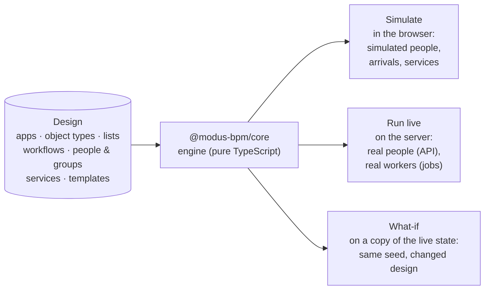
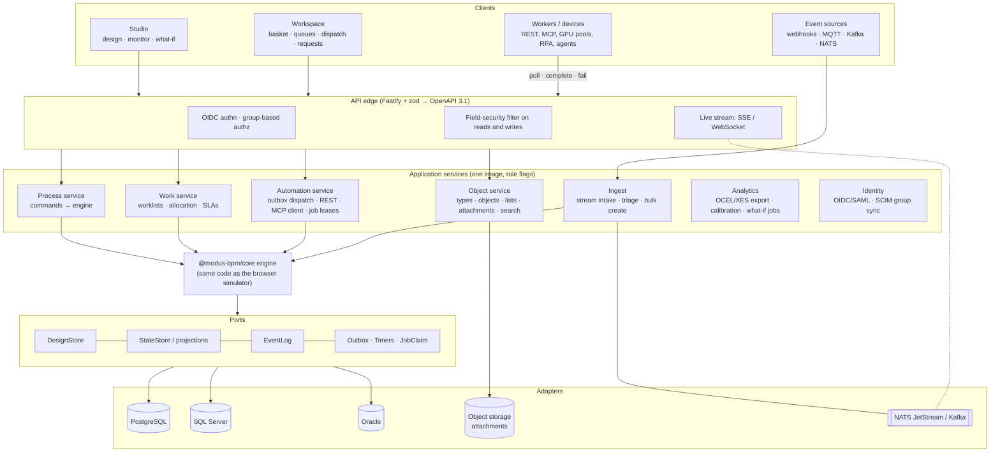
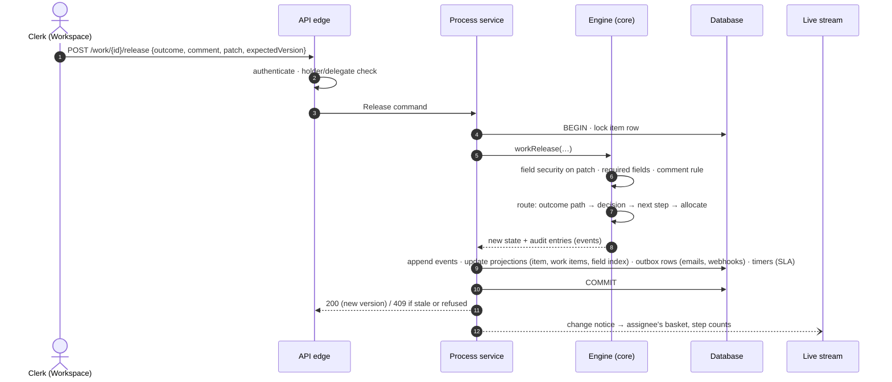
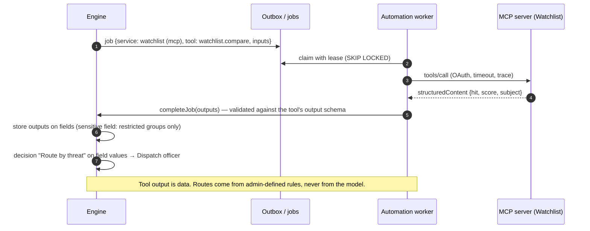

# Architecture

Modus has one idea at its center: **the model is the system**. The process an
administrator draws is the thing that runs, the thing that is simulated, and the thing
that is monitored. There is no second copy that can drift.



The same engine code powers all three. A simulated run is a forecast using production
semantics; a what-if experiment is the live state run forward with a change; and the
production server is the simulator with the simulated parts switched off.

- [Repository layout](#repository-layout)
- [Domain model](#domain-model)
- [Engine semantics](#engine-semantics)
- [Call stack (target)](#call-stack-target)
- [Request sequences](#request-sequences)
- [Persistence and database strategy](#persistence-and-database-strategy)
- [Technology choices](#technology-choices)
- [Security model](#security-model)
- [Deployment](#deployment)
- [From prototype to production: milestones](#from-prototype-to-production-milestones)
- [Decisions and alternatives](#decisions-and-alternatives)

Background research: [competitive analysis](research/competitive-analysis.md) and
[backend options](research/backend-options.md) (engines, databases, libraries, deployment).

## Repository layout

```
packages/core     the model and the engine — no UI, no I/O, deterministic
  src/model       design-time types, rules, field security, templates, sample data
  src/engine      tokens, routing, distribution, services, admin + workspace operations,
                  read models (counts, baskets, queues), what-if scenarios, tests
apps/studio       React app: Studio (design + administer) and Workspace (do the work)
apps/server       the engine live behind a REST API, worker job protocol, live stream
docs              architecture, concepts, roadmap, demo script, research
```

Status today: `core` and `studio` are a complete, browser-only prototype (designs saved in
the browser; work simulated). `server` is a working skeleton with in-memory storage, used to
prove the call stack and the worker protocol end to end.

## Domain model

### Design time (what administrators build)

| Concept | What it is |
| --- | --- |
| **Application** | A bundle of object types, lists and workflows (e.g. Invoice Processing). |
| **Object type** | A dynamically defined record: fields (text, number, currency, date, yes/no, choice, person, email, attachment), numbering, title, priority field, permissions per group, and *sensitive* fields visible only to some groups. Forms are generated from it. |
| **List** | Flat or linked (cascading) reference data: Model Year → Make → Model. |
| **Workflow** | A graph of steps and paths for one object type. `process` workflows start when an item is created; `subflow` workflows run inside a subflow step. Has a target time (due dates) and workflow-wide field locks. |
| **Step types** | Start (form, API, event stream, schedule, inbox) · User step · Automated step · Decision · Parallel split · Join · Subflow · Timer · End. |
| **People & groups** | Users (speed and availability for simulation), team groups (do the work) and distribution groups (dispatchers who hand work out). |
| **Service registry** | Every system automated steps can call: REST/OpenAPI, MCP servers, worker pools (registered services), AI agents, email. Each has operations with typed outputs, a capacity, a status and a credential *reference* (never the secret). |
| **Template** | A reusable subflow with the fields it needs; stamped into any application with a field mapping. |

### Run time (what the engine tracks)

| Concept | What it is |
| --- | --- |
| **Item** (`SimObject`) | One business object moving through a process: its data, priority, due date, status and complete history. |
| **Token** | One thread of execution. An item has one token per active parallel branch. A token at a people step *is* a work item. |
| **Fork / call frames** | A token's stack of the splits it is inside (so a join knows which branches belong together) and the subflows it is running in (so it can return). |
| **Audit entry** | Every routing decision, assignment, release, field change, service call, split, join, escalation and security refusal, with who and when. This is the event log. |

## Engine semantics

The engine is deliberately smaller than full BPMN 2.0 and explicit about the behaviors
business processes actually need. Each maps to a standard concept (see
[CONCEPTS.md](CONCEPTS.md)).

- **Routing.** A decision checks its branches top to bottom against the item's field values;
  the first match wins, with an "Otherwise" path. A user step routes on the outcome the person
  chose. An automated step routes on *Succeeded* / *Failed*. A subflow step routes on the name
  of the ending its subflow reached.
- **Parallel split** runs every path (`all`) or every path whose rule matches (`inclusive`).
  Each branch carries a fork frame.
- **Join** pairs with the innermost fork frame and continues when *all* branches arrived, the
  *first* one arrived, or *N of M* arrived; optionally it withdraws the branches still running.
  Branches that end elsewhere stop being waited for. A rejection in any branch ends the whole
  item (or the whole subflow) and withdraws its siblings.
- **Subflows** push a call frame, run the child workflow on the same item, and pop it at an
  end step. A rejected or cancelled ending with no path out ends the caller the same way.
- **Automated steps** call a registered service. Capacity limits calls in flight (the rest
  queue — automated steps can be bottlenecks too); failures retry, then follow the step's
  policy: take the *Failed* path, hand the work to a person in a fallback group, or stop for an
  administrator. An administrator can take work off an automated step and give it to a person.
- **Distribution** at people steps: load balanced (fewest open items, round robin on ties),
  queue (people claim or "get next", most urgent first), distribution group (dispatchers hand
  each item to someone), direct, and from a field on the item (retain familiar). Escalation
  raises priority, notifies, and/or returns work to the dispatchers after N hours.
- **Field security** has three layers and the strictest wins: sensitive fields restricted to
  groups (object type) → workflow locks (always, or after a step) → step access
  (edit/read/hidden). The engine refuses locked changes and audits the attempt; the forms
  show the same answer.
- **Determinism.** Randomness only comes from a seeded generator stored in the state, so a run
  repeats exactly, a what-if scenario differs from its baseline only by its change, and state
  can be cloned, saved and replayed.
- **Model-driven.** The engine re-reads the design on every call. Edit the map while work is
  in flight and the work follows the new map; work parked at a broken spot resumes when the
  map is fixed.

### Simulation vs live

`advance(sim, ctx, minutes)` moves the clock minute by minute through: arrivals → timers and
escalations → automated calls finishing → people finishing → retrying stuck work → distributing
→ people picking up work. With `ctx.live = true` (the server), arrivals, simulated people and
simulated dispatchers are switched off and service calls become **jobs**:

| | Simulation (studio) | Live (server) |
| --- | --- | --- |
| New items | Poisson arrivals per workflow | API, event streams, schedules |
| People | Simulated speed, outcome weights | Real people via the Workspace / API |
| Dispatchers | Simulated every N minutes | Real dispatchers |
| Service calls | Simulated latency, success rate, outputs | `pollJobs` → worker → `completeJob` / `failJob` |
| Clock | Fast, jumpable | Wall clock (or scaled for demos) |

## Call stack (target)



What exists today in `apps/server`: the edge (REST + SSE, zod validation, `x-user-id` stand-in
for identity), a runtime that serializes commands and writes every audit entry to the event
log, the worker job protocol, and storage ports with an in-memory/JSON adapter.

### API surface (v0, implemented in the skeleton)

| Area | Endpoints |
| --- | --- |
| Discovery | `GET /api`, `GET /api/health`, `GET /api/apps`, `GET /api/apps/:app/overview` |
| Process mining | `GET /api/apps/:app/export/ocel` (OCEL 2.0 JSON of the event log) |
| Items | `POST /api/apps/:app/items`, `GET /api/apps/:app/items/:id` (field-security filtered) |
| My work | `GET …/my/basket`, `…/my/queues`, `…/my/distribution`, `…/my/requests`, `POST …/my/next` |
| Work items | `POST …/work/:id/claim · start · save · release · return · delegate · distribute` |
| Administration | `POST …/admin/work/:id/assign · move · retry` |
| Workers | `POST /api/jobs/poll`, `POST /api/jobs/:id/complete`, `POST /api/jobs/:id/fail` |
| Live | `GET /api/apps/:app/stream` (Server-Sent Events) |

## Request sequences

### A person releases a work item



### A parallel split fires and the join waits

```mermaid
sequenceDiagram
  autonumber
  participant E as Engine
  participant A as Branch A (person)
  participant B as Branch B (ERP worker)
  participant C as Branch C (records worker)
  E->>E: split "Pay & file": fork f1 (expect 3), three tokens
  par
    E->>A: work item in a basket
  and
    E->>B: job for svc_erp
  and
    E->>C: job for svc_records
  end
  B-->>E: complete → token waits at join (1/3)
  C-->>E: fail → retry → complete → (2/3)
  A-->>E: release → (3/3): join continues with one token
  Note over E: Each command locks the item, so exactly one<br/>transaction sees "3 of 3"; two branches can never both be last.
```

### An automated step calls an MCP tool and the result routes the item



### High-volume signals (the camera example)

Camera events land on a stream (NATS JetStream with its MQTT listener, or Kafka). Ingest
workers batch them through AI triage with capacity limits; **only events worth a person's
time become items**, created in bulk. In the sample *Video Security Operations* app the AI
step is bound to a two-GPU worker pool, and the simulation shows it becoming the bottleneck at
120 events/hour — the what-if lab shows that a third and fourth GPU worker clear it.

## Persistence and database strategy

The classic approach — generating a table per object type and altering it whenever a field is
added — needs runtime DDL, per-type migrations and DBA change control for every design edit.
EAV (one row per field value) avoids DDL but makes every query a pile of self-joins. Modus
takes the hybrid that modern databases make cheap:

- **Event log + projections, in one transaction.** Every command appends the item's new events
  (the audit trail) and updates current-state projections (item, tokens, work items) in the same
  transaction. Worklists are immediately consistent; history is complete; replay, process mining
  and simulation calibration come from the same log. A per-item hash chain gives tamper evidence.
- **Objects as JSON documents.** The item's data is one JSON column validated by its object type
  (which is versioned). Fields an administrator marks *searchable* are copied into a narrow,
  typed index table (`object_field_idx`) in the same transaction, with identical DDL on every
  database. Per-type reporting **views** give BI tools tidy columns without copying data.
- **Outbox, timers and job claims in tables**, claimed with `FOR UPDATE SKIP LOCKED` (Postgres,
  Oracle) or `UPDLOCK, READPAST` (SQL Server). No extra infrastructure, exactly-once side effects.

```
object_type(id, tenant_id, key, version, schema_json)
object(id, tenant_id, type_id, type_version, number, title, status, priority, due_at,
       data JSON, row_version, created_at, created_by, updated_at, updated_by)
object_field_idx(tenant_id, type_id, field_id, object_id, v_text, v_num, v_date, v_ref)
item_event(tenant_id, item_id, seq, event_id, kind, at, actor, step_id, token_id,
           payload JSON, model_version, prev_hash)          -- UNIQUE(item_id, seq)
token(id, item_id, workflow_id, step_id, state, assignee_id, forks JSON, calls JSON, …)
work_item(id, item_id, token_id, step_id, state, assignee_id, group_id, priority, due_at)
outbox(id, item_id, kind, payload JSON, idempotency_key, status, attempts, next_at)
timer(id, item_id, due_at, kind, payload JSON, status)
list_item(id, list_id, parent_id, label, sort, active)
attachment(id, object_id, field_id, name, size, mime, sha256, storage_key)
```

### Which databases

| Database | Plan | Notes |
| --- | --- | --- |
| **PostgreSQL 16–18** | First, v1.0 | `jsonb`, expression/GIN indexes, `SKIP LOCKED`, `LISTEN/NOTIFY`, row-level security for hosted multi-tenancy. |
| **SQL Server 2022 / 2025** | Certified in v1.x | 2022: `nvarchar(max)` + `ISJSON` + computed columns; 2025: native `json` type and JSON index. Require `READ_COMMITTED_SNAPSHOT ON`. |
| **Oracle 19c / 26ai** | v1.1 | 19c: CLOB + `IS JSON`; 21c+: native `JSON`. Function-based indexes on `JSON_VALUE`. |

All three sit behind the same storage ports and must pass one shared contract test suite
(containers in CI). The SQL layer is Kysely (MSSQL dialect built in; a community Oracle dialect
we would vendor or contribute to). Vendor-specific features (JSON Relational Duality, SQL
Server JSON indexes) are optional accelerations inside an adapter, never design dependencies.
If Oracle/SQL Server parity ever outweighs one language end to end, the ports keep a .NET/EF
Core server tier feasible; see [backend options](research/backend-options.md#3-multi-database-support-in-practice).

## Technology choices

| Layer | Choice | Status |
| --- | --- | --- |
| Engine | Own deterministic TypeScript engine (`@modus-bpm/core`), shared by simulator and server | **Done** (prototype) |
| Studio + Workspace | React 19, Vite, Tailwind CSS 4, React Flow 12, Zustand | **Done** (prototype) |
| API edge | Node.js LTS, Fastify 5, zod 4 → OpenAPI 3.1; SSE for live updates | **Skeleton** |
| Data access | Kysely behind storage ports; contract test suite | Planned (M2) |
| Database | PostgreSQL first; SQL Server, then Oracle | Planned (M2, M6, v1.1) |
| Jobs, timers, outbox | Own tables + SKIP LOCKED / READPAST claims | Planned (M3–M4) |
| Automation | REST/OpenAPI connector; MCP client (TypeScript SDK v2, spec 2026-07-28); long-poll worker protocol (gRPC later); JSONata mapping | Protocol **skeleton**; connectors planned (M4) |
| Event ingest | NATS JetStream (incl. MQTT listener); Kafka connector optional | Planned (M5) |
| Identity | OIDC (Keycloak, Entra ID, Login.gov), SAML; SCIM 2.0 group sync | Planned (M2–M6) |
| Observability | OpenTelemetry traces across click → command → job → MCP call; Prometheus metrics; structured logs | Planned |
| Process mining | OCEL 2.0 export from the event log (`exportOcel`); XES (IEEE 1849-2023) next | OCEL **done**; XES planned |

## Security model

- **Identity**: OIDC/SAML sign-in; directory groups mapped to Modus groups through SCIM.
  The prototype's persona picker and the server's `x-user-id` header are stand-ins.
- **Authorization layers**: object-type permissions (create/read/update/delete per group); who
  may act on a work item (holder, delegate, dispatcher, supervisor, administrator); and field
  security (sensitive fields → workflow locks → step access). Reads are filtered (hidden fields
  never leave the server); writes are refused and audited.
- **Audit**: append-only, hash-chained per item; administrator overrides are labeled as such.
- **Secrets**: the service registry stores only a credential *reference*; the automation
  service resolves it from the secret store at call time.
- **AI and tools**: tool and agent output is data validated against an output schema; routing
  stays in administrator-defined rules. Agents only see the fields their step may read.

## Deployment

| Tier | Shape |
| --- | --- |
| Pilot | One container image (all roles) + PostgreSQL via Docker Compose. |
| Department / enterprise | Helm chart; the same image per role (`api`, `engine`, `automation`, `scheduler`, `ingest`, `realtime`); managed or operator-run Postgres; NATS JetStream cluster; S3-compatible storage. |
| SQL Server / Oracle shops | Same chart with `DB_DIALECT=mssql|oracle` against the customer's database; migrations shipped as SQL scripts DBAs can run. |
| Air-gapped / government | No phone-home; SBOMs and signed images; offline bundle; NIST 800-53 control mapping. Self-hosted installs inherit the agency's authorization. |

Multi-tenancy: `tenant_id` in every key and query from day one (enforced by the ports),
Postgres row-level security as defense in depth for a hosted edition, database-per-tenant for
customers who need hard separation.

## From prototype to production: milestones

| | Milestone | Exit criteria |
| --- | --- | --- |
| **M1** | Kernel hardening | Split the engine's command handlers from the simulation drivers further (`decide/evolve` over typed events); property tests and a "one million simulated items, zero stuck tokens" fuzz run; versioned JSON Schemas for designs. *Partly done: live mode, tokens, split/join, subflows, OCEL export, separation of duties; 46 tests across engine and server.* |
| **M2** | Server on Postgres | Kysely migrations; events + projections + outbox + timers with per-item locking; object types, objects, lists, attachments; OIDC login; single image + Compose. |
| **M3** | Work service and Workspace on the server | Worklists and all distribution modes with SKIP LOCKED claims; delegation, out of office, SLA timers with business calendars; the studio's Workspace and Monitor wired to the API and the live stream. |
| **M4** | Automation | Outbox dispatcher; REST/OpenAPI and MCP connectors; worker SDKs (TypeScript, Python, .NET, Java) from OpenAPI; retries, incidents, tracing. |
| **M5** | Scale, ingest, analytics | Stream ingest and triage; OCEL/XES export; simulation calibrated from the log; Helm chart; load tests (target 100 signals/s sustained, 1,000 concurrent Workspace users). |
| **M6** | Hardening, second database, v1.0 | SQL Server adapter certified by the contract suite; SCIM/SAML; multi-tenancy; backup/upgrade runbooks; SBOM, signing, air-gap bundle; external security review. Oracle in v1.1. |

## Decisions and alternatives

| Decision | Why | Alternatives considered |
| --- | --- | --- |
| Build our own engine in TypeScript | One semantics for simulation, production and replay ("the simulator is the engine"); first-class work allocation; fully open license. | Camunda 8 (production needs a commercial license), Flowable (Apache-2.0 and multi-database, but a Java sidecar and a second model), Temporal (code-first, weak human tasks, no SQL Server/Oracle). |
| Narrower-than-BPMN semantics | Business users must be able to read and change every step; we add only what processes need (split/join modes, subflows, timers, escalations). | Full BPMN 2.0 execution. BPMN XML export is planned for interoperability. |
| Postgres first, then SQL Server, then Oracle | Honest sequencing behind ports and a shared contract suite. | "Any database" via a heavy ORM (TypeORM/MikroORM); .NET EF Core if parity becomes the top requirement. |
| Hybrid event log + projections | Immediate worklists, full audit, replay and mining from one write. | Pure event sourcing (eventually consistent worklists); state + audit table (lossy replay). |
| JSON documents + field index for dynamic types | No runtime DDL; portable; fast search on chosen fields. | Per-type generated tables; EAV. |
| Apache-2.0 license | Permissive and patent-safe; the market is moving to source-available, so a fully open core is a differentiator. | MIT; AGPL. |
