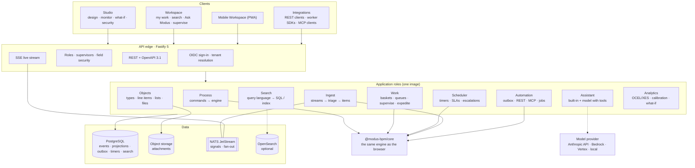
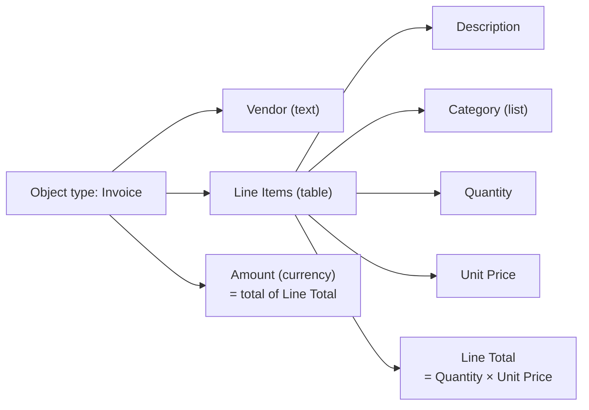
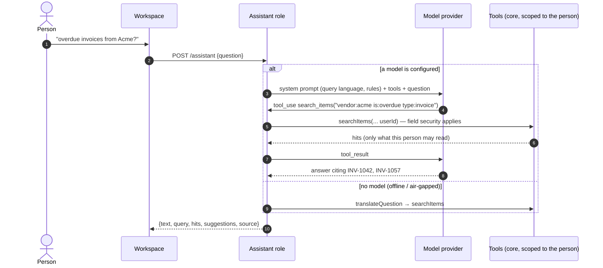
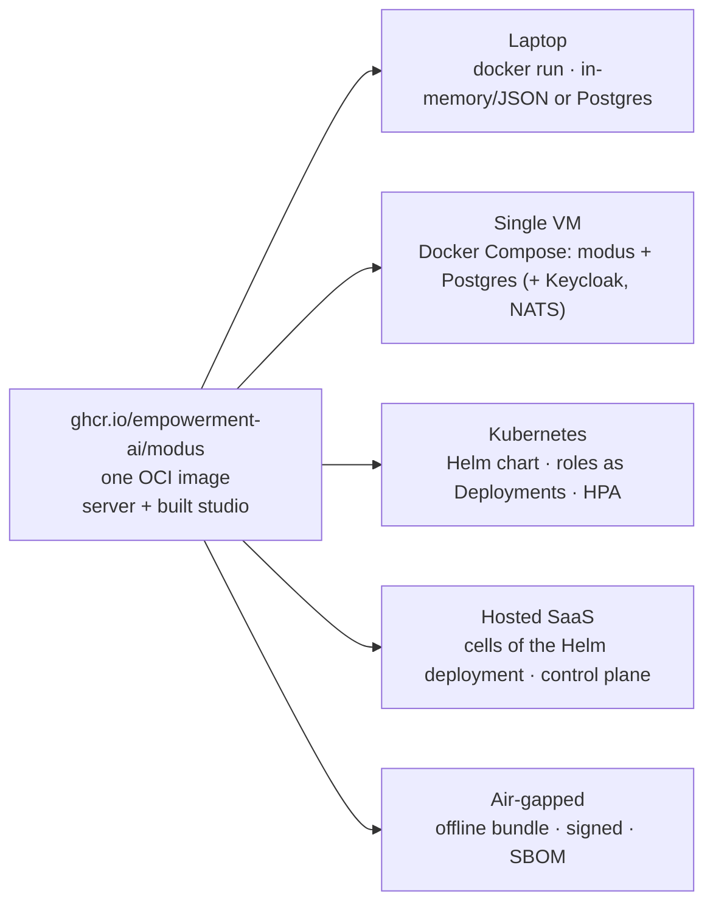
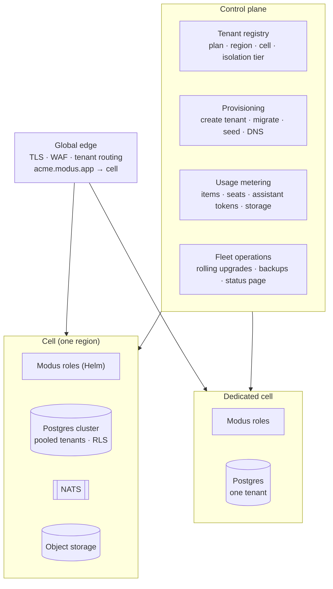

# Technology stack

This is the full stack Modus uses to go from today's prototype to a product that runs as a
hosted SaaS or on a laptop. It covers every layer, explains why each piece was chosen, and
shows where each feature lives. [ARCHITECTURE.md](ARCHITECTURE.md) has the engine semantics,
data model and request sequences. [DEPLOYMENT.md](DEPLOYMENT.md) has the operator's guide
(Docker, Compose, Helm, configuration).

**Three rules shape every choice:**

1. **One engine everywhere.** The engine (`@modus-bpm/core`) is pure TypeScript with no I/O.
   The same code runs the browser simulator, the what-if lab and the production server.
2. **One image, any size.** A single container image runs every role. A laptop runs it as one
   process. A SaaS cluster runs the same image as separately scaled roles.
3. **Open and portable.** Every dependency on the critical path is Apache-2.0, MIT, BSD or
   PostgreSQL licensed. No feature depends on one cloud. PostgreSQL comes first; SQL Server and
   Oracle sit behind the same storage ports.

- [The stack at a glance](#the-stack-at-a-glance)
- [Layered architecture](#layered-architecture)
- [Frontend](#frontend)
- [API edge](#api-edge)
- [Engine host: from simulator to server](#engine-host-from-simulator-to-server)
- [Data](#data)
- [Line items (multi-row data)](#line-items-multi-row-data)
- [Search](#search)
- [Ask Modus: the assistant](#ask-modus-the-assistant)
- [Roles, supervisors and authorization](#roles-supervisors-and-authorization)
- [Priority and expedite](#priority-and-expedite)
- [Automation, events and realtime](#automation-events-and-realtime)
- [Identity, secrets and files](#identity-secrets-and-files)
- [Observability](#observability)
- [Packaging: one image, many shapes](#packaging-one-image-many-shapes)
- [SaaS architecture](#saas-architecture)
- [Running locally](#running-locally)
- [Build, test and supply chain](#build-test-and-supply-chain)
- [Repository layout (target)](#repository-layout-target)
- [Where each feature lives](#where-each-feature-lives)
- [Build order](#build-order)

## The stack at a glance

| Layer | Choice | License | Status |
| --- | --- | --- | --- |
| Language | TypeScript 6 everywhere, ESM, strict | Apache-2.0 | In use |
| Runtime | Node.js LTS (22 in the image today; 24 and then 26 as they become LTS) | MIT | In use |
| Monorepo | pnpm workspaces | MIT | In use |
| Engine | `@modus-bpm/core`: deterministic, I/O-free, seeded randomness | Apache-2.0 (ours) | **Prototype complete** |
| Web app | React 19, Vite 8, Tailwind CSS 4, React Flow 12, Zustand 5, Immer, Lucide icons | MIT | **Prototype complete** |
| Server state in the browser | TanStack Query (cache, retries, optimistic updates) over the REST API | MIT | Planned (M3) |
| API | Fastify 5 + zod 4 → OpenAPI 3.1; Server-Sent Events for live updates | MIT | **Skeleton** |
| SQL layer | Kysely (typed SQL builder) behind storage ports | MIT | Planned (M2) |
| Database | PostgreSQL 16–18 first; SQL Server 2022/2025; Oracle 19c/23ai+ | PostgreSQL / commercial | Planned (M2, M6, v1.1) |
| Search | Postgres full-text + `pg_trgm` + typed field index; optional `pgvector`; optional OpenSearch 3 | PostgreSQL / Apache-2.0 | Built in the engine; DB-backed planned (M3) |
| Assistant | Built-in interpreter (offline) + Claude via the Anthropic API with tool use; a pluggable model port | — | Built-in **done**; model path in the server |
| Messaging | Outbox tables first; NATS JetStream (with its MQTT listener) for event ingest and fan-out | Apache-2.0 | Planned (M4–M5) |
| Automation | REST/OpenAPI connector, MCP client (TypeScript SDK v2), worker long-poll protocol, JSONata mapping | MIT / Apache-2.0 | Protocol **skeleton** |
| Identity | OIDC (Keycloak bundled; Entra ID, Okta, Login.gov), SAML, SCIM 2.0 | Apache-2.0 | Planned (M2–M6) |
| Files | Local volume (single node) or any S3-compatible store | — | Planned (M2) |
| Observability | OpenTelemetry (traces, metrics), pino JSON logs, Prometheus, Grafana | Apache-2.0 / MIT / AGPL (Grafana, optional) | Planned |
| Packaging | One OCI image; Docker Compose; Helm chart; GHCR | — | **In progress** |
| CI/CD | GitHub Actions, Vitest, Playwright, Testcontainers, Buildx, cosign, Syft SBOM | MIT / Apache-2.0 | Vitest + Actions **in use** |

## Layered architecture



Every application role is a module in one Node.js codebase. A deployment chooses which roles a
process runs with `MODUS_ROLES` (default: all). Module boundaries follow the roles, so splitting
a role into its own service later is a deployment change, not a rewrite.

## Frontend

| Concern | Choice | Why |
| --- | --- | --- |
| Framework | **React 19** with function components and hooks | The largest talent pool. React 19's transitions keep the map and the forms responsive while the simulator runs. |
| Build | **Vite 8** | Fast dev server; one config builds the hosted app, the static demo and a single-file offline build (`vite-plugin-singlefile`). |
| Styling | **Tailwind CSS 4** with design tokens as CSS variables | Consistent spacing and color without a component-library lock-in; dark mode and theming per tenant come from the tokens. |
| Process map | **React Flow 12** (`@xyflow/react`) | Mature, MIT, handles hundreds of nodes, custom node renderers for live counts and heat. |
| State | **Zustand 5** + Immer for local and design state; **TanStack Query** for server state (planned) | Zustand keeps the simulator's high-frequency updates cheap. TanStack Query adds caching, retries and optimistic updates once the Workspace talks to the server. |
| Forms | Generated from the object type by one renderer (`FormRenderer`), including line-item grids | A field added in the designer appears in every form, on the server's validation and in search without code. |
| Icons | Lucide | MIT, consistent, tree-shaken. |
| Live updates | `EventSource` (SSE) | Works through proxies and HTTP/2; no WebSocket infrastructure needed for one-way updates. |
| Accessibility | WCAG 2.2 AA / Section 508 target: keyboard paths for every action, labeled controls, visible focus | Public-sector buyers require it. Automated checks with axe in Playwright (planned). |
| Internationalization | FormatJS (`react-intl`) message catalogs; `Intl` for dates, numbers and currency | Planned; labels designers type stay as entered and can carry translations per locale. |
| Mobile | The Workspace as an installable PWA (offline read of my work, push notifications) | Planned for field users such as officers. |

The studio needs no server: it simulates the organization in the browser. In M3 the Workspace
and Monitor gain a server mode that reads the API and live stream instead of the simulator. The
engine is identical either way.

## API edge

The skeleton already has the routes, zod validation, the live stream, health checks and static
serving; the hardening rows are the target for M2.

| Concern | Choice |
| --- | --- |
| HTTP server | **Fastify 5**: the fastest mainstream Node framework, schema-first, a mature plugin set. |
| Validation and contracts | **zod 4** schemas on every route, exported as **OpenAPI 3.1**. Clients (TypeScript, Python, .NET, Java) are generated from it. |
| Style | REST resources plus command endpoints (`POST …/work/:id/release`). Optimistic concurrency with `expectedVersion` → `409 Conflict`. `Idempotency-Key` on creates and commands. |
| Live | SSE per application (`/api/apps/:app/stream`); events are change notices, never data the caller may not read. |
| Hardening | `@fastify/helmet`, CORS allow-list, `@fastify/rate-limit` (per user and per tenant; a stricter budget on the assistant), request size limits, structured errors (RFC 9457 problem details). |
| Static app | The same server serves the built studio (`STATIC_DIR`), so one container is the whole product. |
| Health | `/api/health` (liveness: the process is up) and `/api/ready` (readiness: storage reachable, migrations applied). |

Why REST and not GraphQL or tRPC: integrators in government and enterprise use Java, .NET and
Python and expect OpenAPI. tRPC would tie clients to TypeScript; GraphQL may come later as a
read-only reporting layer.

## Engine host: from simulator to server

Today the engine keeps the whole organization in one in-memory state (`SimState`). That is ideal
for simulation and fine for the server skeleton. Production changes how state is *loaded*, not
what the engine *decides*:

| | Today (prototype / skeleton) | Production |
| --- | --- | --- |
| Unit of work | The whole state | **One item** (an invoice, an event) and its tokens |
| Concurrency | One command at a time | One command at a time **per item** (row lock); different items in parallel |
| Load | Everything in memory | The item's projection (object + tokens + open work items) |
| Cross-item facts | Scans of the in-memory state | Read models in SQL: open load per person (load balancing), queue order, separation-of-duties history |
| Output | Mutated state + audit entries | The same audit entries become **events**; projections, outbox rows and timers are written in the same transaction |
| Time | `advance(minutes)` | The scheduler role claims due timers (SLA, escalation, timer steps) |

The engine's allocation logic asks a small `Workload` port ("open items per member of group
G") instead of scanning tokens, so the same code runs against memory in the browser and SQL on
the server. Milestone M1 finishes this split (`decide`/`evolve` over typed events).

## Data

PostgreSQL is the system of record. Everything an item needs — its events, its current state,
its work items, its outbound calls and its timers — is written in **one transaction**, so
worklists are never stale and nothing is lost between "routed" and "notified".

| Store | Holds | Why |
| --- | --- | --- |
| `item_event` | Every engine event (the audit trail), hash-chained per item | History, replay, process mining (OCEL 2.0 / XES), simulation calibration. |
| `object` (JSON `data`) | The item's fields, **including line items** | Dynamic types without runtime DDL; one read gets the whole record. |
| `object_field_idx` | Typed copies of *searchable* fields (`v_text`, `v_num`, `v_date`, `v_ref`) | Fast filters and sorts with identical DDL on every database. |
| `object_row_idx` | Typed copies of searchable *line-item columns*, one row per line | "Any line where Category is Software", sums by category, without unpacking JSON at query time. |
| `object_search` | The item's search document(s): `tsvector` + trigram text, by security scope | Full-text search with field security built in (see [Search](#search)). |
| `token`, `work_item` | Where each branch is and who holds what | Baskets, queues, supervision boards and counts are plain indexed queries. |
| `outbox`, `timer`, `job` | Side effects, SLA timers, worker jobs | Claimed with `FOR UPDATE SKIP LOCKED` (Postgres, Oracle) or `UPDLOCK, READPAST` (SQL Server). No extra queue infrastructure. |
| Design tables | Object types, lists, workflows, groups, services, templates; versioned | Every published design is immutable; items record the version they run on. |

**Database portability.** All SQL goes through Kysely behind storage ports (`DesignStore`,
`ItemStore`, `EventLog`, `WorkStore`, `SearchIndex`, `Outbox`, `TimerStore`, `JobClaim`). One
contract test suite runs against each certified database in containers. JSON storage maps to
`jsonb` (Postgres), `nvarchar(max)` + `ISJSON` or the native `json` type (SQL Server 2022 /
2025) and native `JSON` (Oracle 21c+). The full comparison is in
[backend options](research/backend-options.md#3-multi-database-support-in-practice).

**Connection management.** PgBouncer (transaction pooling) in front of Postgres for SaaS. The
scheduler and automation roles use `SKIP LOCKED` claims, so several replicas can run without
leader election.

**Caching.** None is required. Designs are cached in-process per version (immutable). If a
shared cache becomes necessary, Valkey (BSD) — not Redis 8, whose licenses are not
permissive.

## Line items (multi-row data)

An invoice has line items; a purchase request has requested items; an inspection has findings.
Modus models these as a **table field**: a field whose value is a list of rows with typed
columns.



| Concern | How it works |
| --- | --- |
| Definition | `type: 'table'` with `columns` (text, number, currency, date, yes/no, choice from a list, person, email), `minRows`/`maxRows`, per-column `required`/`min`/`max`. |
| Calculations | Formula columns (`Quantity × Unit Price`) and **total fields** (`Amount = sum of Line Total`). The engine recalculates them on every write (`normalizeData`), so the browser, the server and the API can never disagree. Calculated values are read-only everywhere. |
| Rules | Decisions can test line items: number of rows, sum/lowest/highest of a column, *any row where* or *every row where* a column matches ("any line where Category is Software"). |
| Security | A table is one field for security: editable, read-only or hidden as a whole. If a total is locked (for example after approval), the table that feeds it locks too, so the total can't be changed through its lines. |
| Storage | Rows live inside the item's JSON document with stable row ids. This keeps the item atomic: one version, one audit entry per change ("Line Items: 3 → 4 rows"), one read. |
| Querying | Searchable columns are copied to `object_row_idx` in the same transaction for search, filters and reports (e.g. spend by category). |
| Large tables | Above a configurable size (default 500 rows), a table switches to a child table (`object_row`) with paged reads; the engine works on the same row model. Most business tables never get there. |
| Integrations | The API takes and returns rows as JSON arrays. Automated steps can read and write whole tables or map a service's array output into rows (JSONata). |

## Search

People find work by number, by words anywhere in it (including line items and comments), and
by structured filters. One query language serves the search box, the assistant and the API:

```
acme laptop "net 30" -freight          words, phrases, exclusions
priority:urgent  is:overdue  is:expedited  is:mine  is:escalated
step:"manager approval"  assignee:me  creator:me  type:invoice
created:<2d  due:<4h  amount>10k  category:software   (any field or line-item column, by label)
```

The core parses the query once (`parseQuery`) and each backend compiles it. Results are ranked,
come with snippets showing where the words matched, and carry facets (status, priority, step,
type) for one-click narrowing.

| Tier | Backend | When |
| --- | --- | --- |
| In-browser | The engine's in-memory index (`searchItems`) | The simulator and demo; small local installs. **Done.** |
| Default server | **PostgreSQL**: `tsvector` with weighted fields (title and number highest), `websearch`-style parsing, `pg_trgm` for typo tolerance and prefixes, `object_field_idx` / `object_row_idx` for filters and sorts | Every install; no extra service. Comfortable to tens of millions of items with partitioning by tenant and year. |
| SQL Server / Oracle | SQL Server Full-Text Search; Oracle Text | The same query language compiled to each dialect. |
| Similar items and meaning | **pgvector** embeddings of the item's text (optional) | "Find invoices like this one", duplicate detection, semantic matches for the assistant. Embeddings come from an embeddings port: a hosted model, or an open-weights model served locally for air-gapped sites. |
| Very large tenants | **OpenSearch 3** fed from the outbox | Billions of documents, heavy faceting. Optional; the database stays the source of truth. |

**Security is part of the index, not a filter afterward.** Each item has a search document for
its ordinary fields and separate documents for *sensitive* fields, one per restriction group.
A query only matches the documents the person may read, so a hidden bank account number can
never be found by guessing digits. Fields that a workflow lock hides are removed from the index
when the lock applies. Who may see an item at all (object-type read permission, creator,
current holder, supervisor, administrator, auditor) becomes a SQL predicate. The same rules run
in the browser engine today, with tests.

## Ask Modus: the assistant

People ask questions in plain words: *"urgent invoices over 10k"*, *"what's waiting on me?"*,
*"where is the bottleneck?"*, *"how do I delegate?"*. The assistant answers with the work
itself and always shows the search it ran, so people learn the query language and can trust
the result.



| Concern | Design |
| --- | --- |
| Two tiers | **Built-in** (deterministic, offline, always on): a question → query translator plus a help library, in the core. **Model-backed** (optional): Claude with tool use, configured with `ANTHROPIC_API_KEY`. Same response shape, so the UI doesn't care which answered. |
| Tools | `search_items`, `get_item`, `my_work`, `process_overview`, `explain`. Each calls the core **as the person asking**, so the model only ever sees what that person could see in the Workspace. |
| Read-only | The assistant answers and suggests; it never changes work. Actions it proposes ("expedite INV-1042?") are rendered as buttons the person confirms, which go through the normal API and permission checks. |
| Guardrails | Tool output is data, not instructions. Answers must cite item numbers. Tool-call loops are capped; tokens and requests are budgeted per tenant. |
| Providers | A `ModelProvider` port: the Anthropic API by default; Claude on Amazon Bedrock or Google Vertex AI for customers who need it inside their cloud account; any OpenAI-compatible endpoint (for example a local open-weights model) for air-gapped sites, with the built-in tier as the floor. |
| Cost and speed | Prompt caching for the system prompt and tool definitions; streaming answers over SSE; the built-in tier answers simple lookups without calling a model at all. |
| Privacy | Questions and tool calls are logged to the audit trail (configurable retention). No customer data is used for training; no telemetry leaves a self-hosted install unless configured. |

## Roles, supervisors and authorization

Authorization combines three models, each where it fits best:

| Model | Used for | Examples |
| --- | --- | --- |
| **Roles (RBAC)** | Organization-wide powers | *Administrator* (manage all work and settings), *Designer* (change designs), *Auditor* (read everything, change nothing). |
| **Relationships (ReBAC)** | Who may act on a specific item | The holder, a delegate, the dispatchers of a distribution group, the **task supervisors** of the step it is at, the **process supervisors** of the workflow it is in (including every caller of a subflow). |
| **Attributes (ABAC)** | Fields | Sensitive fields restricted to groups, workflow locks ("Amount is read-only after Manager Approval"), step access. The strictest wins. |

| Who | Can |
| --- | --- |
| Worker | Their basket and queues; release, return, delegate within their group. |
| Dispatcher | Hand out work in their distribution group. |
| **Task supervisor** (named on the step, or the work group's supervisor) | See everything at the step; reassign within the group, return to the queue, release on behalf (with a comment), retry, set priority, expedite, redistribute evenly. Escalations can notify them. |
| **Process supervisor** (named on the workflow) | The same powers on every step of the process, including its subflows. |
| Administrator | Everything, across groups. |
| Auditor | Read every item and its history; no changes. |

All checks are **pure functions in the core** (`supervisesStep`, `canSuperviseToken`,
`hasRole`, `fieldVerdicts`). The browser uses them to show the right buttons; the server uses
the same functions to enforce. Directory groups map to Modus groups and roles through OIDC
claims or SCIM 2.0. A dedicated policy engine (OpenFGA, Cedar) was considered; the rules are
small, process-specific and must also run inside the simulator, so they stay in the engine. A
policy engine remains an option for customers who want central policy.

## Priority and expedite

Every item has a **priority** (Low, Normal, High, Urgent) from a field, raised by escalation or
set by a supervisor. Some items must jump the line — a rush payment, a VIP request, a live
incident — so a person can **expedite** an item:

| Effect | How |
| --- | --- |
| Front of the line | Expedited work outranks Urgent in every queue, basket and dispatch board (`urgencyRank`). |
| Faster clocks | Step service levels and the process target shrink by the policy's factor (e.g. half), so due dates, SLA alerts and escalations come sooner. |
| Fast lanes | Rules can test **Expedited** and **Work priority** like any field ("expedited and under $5,000 → skip manager approval"). |
| Policy per process | Who may expedite (anyone, the requester, supervisors), whether a reason is required, how much faster. Every expedite is audited with who and why. |
| Proof | The Monitor compares expedited and normal cycle time; the what-if lab simulates "expedite 20% of arrivals" to show what it does to everyone else. |

In SQL, urgency is a column on `work_item` (`urgency_rank`, `due_at`) with a composite index, so
"get next" is one indexed `ORDER BY … LIMIT 1 FOR UPDATE SKIP LOCKED`. A per-process **expedite
budget** (for example "at most 10% of open items") is planned so the fast lane stays fast.

## Automation, events and realtime

| Concern | Choice |
| --- | --- |
| Outbound calls | **Transactional outbox**: the engine writes a job row in the same transaction as the routing; the automation role claims it with a lease, calls the service, and reports the result as a command. Exactly-once side effects without a message broker. |
| Connectors | REST/OpenAPI (operation picked from the spec), **MCP client** (TypeScript SDK v2; Streamable HTTP; OAuth), email (SMTP or provider API), AI agents. Outputs are validated against the operation's schema before they touch fields. |
| Workers | HTTP long-poll "fetch and lock" (`/api/jobs/poll` → complete/fail), gRPC streaming later. Thin SDKs generated from OpenAPI for TypeScript, Python, .NET and Java. GPU pools and RPA bots are just workers. |
| Mapping | JSONata for input/output mapping; decisions stay declarative (the rule model). User scripts, if ever allowed, run in a WebAssembly sandbox (QuickJS), never in the server process. |
| Event ingest | **NATS JetStream** (Apache-2.0, single binary, runs air-gapped) with its built-in **MQTT** listener for cameras and devices; a Kafka connector when the customer already runs Kafka. Ingest workers triage in batches; only events worth a person's time become items, created in bulk. |
| Realtime | After commit, a small change notice goes out (Postgres `LISTEN/NOTIFY` on one node, NATS across replicas). The realtime role batches counts per second and pushes them over SSE; per-person notices update baskets instantly. |
| Processes as tools | Planned: Modus exposes its own MCP server so agents can start processes, check status and search work — with the same permissions as a person. |

## Identity, secrets and files

| Concern | Choice |
| --- | --- |
| Sign-in | **OIDC** (authorization code + PKCE) via `openid-client`; works with Entra ID, Okta, Google, Login.gov and **Keycloak**, which ships in the Compose file for local and self-hosted installs. SAML for older identity providers. |
| Users and groups | **SCIM 2.0** endpoint for provisioning; group claims map to Modus groups and roles. Just-in-time user creation on first sign-in. |
| API clients and workers | OAuth client credentials (or per-pool tokens) scoped to a tenant and to service topics. |
| Secrets | Never in designs or the database: the service registry stores a *reference*; the automation role resolves it at call time from the environment, Kubernetes Secrets, HashiCorp Vault / OpenBao, or a cloud secret manager (via External Secrets Operator). |
| Encryption | TLS everywhere; database and storage encryption at rest; **envelope encryption** of sensitive fields with a per-tenant key from a KMS (planned for the hosted edition). |
| Files | A storage port: a local volume for single-node installs, any **S3-compatible** store for servers (AWS S3, Google Cloud Storage, Ceph RGW, SeaweedFS), Azure Blob via its adapter. Uploads go direct with pre-signed URLs; ClamAV scanning before a file becomes visible. |

## Observability

| Signal | Choice |
| --- | --- |
| Traces | **OpenTelemetry**: one trace from a click through the command, the outbox job, the worker or MCP call, and the routing that followed (trace context stored on outbox rows). Export via OTLP to any backend (Grafana Tempo, Jaeger, Datadog, Honeycomb). |
| Metrics | OTel metrics exported for **Prometheus**: commands/s, latency per command, open work by step, timer lag, outbox depth, job age, assistant calls and tokens. |
| Logs | **pino** JSON logs with trace ids; no field values in logs (they may be sensitive). |
| Business metrics | The Monitor itself: counts per step, bottleneck, SLA breaches, workload, expedited vs normal cycle time — computed from projections, not logs. |
| Process mining | OCEL 2.0 export today (`/export/ocel`); XES next. |

## Packaging: one image, many shapes



| Piece | What it is |
| --- | --- |
| **Image** | Multi-stage `Dockerfile`: install with pnpm, build the studio, bundle the server with esbuild into one file, run on a small Node.js base as a non-root user. Serves the API and the studio on one port. Health check built in. |
| **Roles** | `MODUS_ROLES=api,engine,automation,scheduler,ingest,realtime` (default: all). Kubernetes runs each role as its own Deployment from the same image. |
| **Compose** | `docker compose up` runs Modus alone. Optional profiles add PostgreSQL, NATS (with MQTT) and Keycloak. |
| **Helm chart** | `deploy/helm/modus`: probes, resources, autoscaling, disruption budget, ingress, secret references (`DATABASE_URL`, `ANTHROPIC_API_KEY`), role selection. |
| **Configuration** | Environment variables only (twelve-factor), documented in one place; the full reference is in [DEPLOYMENT.md](DEPLOYMENT.md). |
| **Releases** | Images on GHCR tagged by version and commit, multi-architecture (amd64, arm64), signed with cosign, with an SBOM attached. |

## SaaS architecture



| Concern | Design |
| --- | --- |
| Tenant identity | Resolved at the edge from the host name (`acme.modus.app`) or a custom domain; carried in every request; `tenant_id` is part of every key, index and storage-port call from day one. |
| Isolation tiers | **Pooled** (many tenants per Postgres, row-level security as defense in depth), **dedicated database**, **dedicated cell** (single-tenant stack, customer region, customer-managed keys). Same image and chart for all three. |
| Cells | A cell is one Helm deployment plus its Postgres cluster, NATS and storage, sized for a few thousand tenants. Growth adds cells; a noisy tenant moves to its own cell. Blast radius stays small. |
| Data residency | Cells per region; a tenant's data never leaves its cell. |
| Upgrades | Rolling, cell by cell. Database migrations are expand → migrate → contract so old and new pods run side by side. Published designs are versioned, so in-flight items finish on the version they started. |
| Backups | Point-in-time recovery for Postgres (CloudNativePG or managed), object-storage versioning, per-tenant export (designs + items + events) for portability and offboarding. |
| Metering | Counted from the event log (items created, work completed, automation calls) and from the assistant (tokens), so bills are auditable. |
| Compliance | SOC 2 for the commercial SaaS; for US government, FedRAMP 20x is the route for a hosted edition, while self-hosted installs inherit the agency's authorization. |

## Running locally

| Need | How |
| --- | --- |
| Try it | Open the [live demo](https://empowerment-ai.github.io/modus/) — or the single-file build, which runs from disk with no install. |
| Develop | `pnpm install && pnpm dev` (studio on Vite) and `pnpm --filter @modus-bpm/server dev` (API). |
| Run the product | `docker run -p 8787:8787 ghcr.io/empowerment-ai/modus` → studio and API on one port, in-memory storage with a JSON snapshot on a volume. |
| With a database and sign-in | `docker compose --profile postgres --profile keycloak up` (Postgres support lands in M2). |
| Without Docker | A planned embedded mode uses **PGlite** (Postgres compiled to WebAssembly) so the same Postgres adapter runs in one process, and Node's single-executable applications can ship it as one binary. |

Local and SaaS differ only in configuration: the same image, the same storage adapter, the
same migrations.

## Build, test and supply chain

| Concern | Choice |
| --- | --- |
| CI | GitHub Actions: typecheck, unit tests, build on every push; Pages deploys the demo; the container workflow builds on pull requests and pushes images from `main`. |
| Unit tests | **Vitest** for the engine (routing, split/join, subflows, security, line items, search, assistant, expedite, supervisors) and the server (Fastify `inject`). |
| Database tests | **Testcontainers**: one storage contract suite against Postgres 16/17/18, SQL Server 2022/2025 and Oracle Free. |
| End-to-end | **Playwright** against the built studio and a server container: create, work, search, supervise, expedite; axe accessibility checks. |
| Property and soak tests | Randomized designs and arrivals: "one million simulated items, zero stuck tokens". |
| Load tests | k6 against the API (target: 100 signals/s sustained, 1,000 concurrent Workspace users). |
| Supply chain | Lockfile installs, Renovate updates, Syft SBOMs, Trivy/Grype scans, cosign signatures, provenance attestations; hardened base images for government (UBI or Iron Bank submission). |
| Releases | Semantic versions; changesets per package; the API versioned in the path (`/api/v1`) once stable. |

## Repository layout (target)

```
packages/
  core                 engine + model (exists)
  storage-postgres     Kysely adapter, migrations, search compiler (M2)
  storage-mssql        SQL Server adapter (M6)
  storage-oracle       Oracle adapter (v1.1)
  sdk                  worker and API clients, generated from OpenAPI (M4)
apps/
  studio               React app: Studio + Workspace (exists)
  server               Fastify server, all roles (exists, skeleton)
deploy/
  helm/modus           Helm chart
docker-compose.yml, Dockerfile
docs/                  architecture, stack, deployment, concepts, roadmap, research
```

## Where each feature lives

| Feature | Engine (core) | Server | Database | UI |
| --- | --- | --- | --- | --- |
| Line items | Table fields, formulas, totals, rules on rows, field security | Validates and recalculates on every write | Rows in the item's JSON; `object_row_idx` | Grid in every form; columns editor in Object Types |
| Search | Query language, ranking, snippets, facets, security | `GET /search` | FTS + trigram + field and row indexes; optional pgvector / OpenSearch | Search page, ⌘K quick search |
| Ask Modus | Built-in interpreter and help | Model with tools; fallback to built-in | Audit of questions | Chat panel |
| Supervisors and roles | Who supervises what; supervise operations | Role- and relationship-checked routes | Roles, supervisors in design tables | Supervise page; Roles tab; pickers in the designer |
| Expedite | Urgency rank, faster clocks, fast-lane rules, policy | `POST /expedite` | `urgency_rank` on work items | Button, badge, reason dialog; Monitor stats; what-if |
| Parallel work, subflows | Tokens, forks, joins, call frames | Per-item serialized commands | `token` table | Map, counts |
| Automation | Jobs, retries, failure policy | Outbox, connectors, worker protocol | `outbox`, `job` | Integrations |
| Field security | Three layers, verdicts | Filters reads, refuses writes | Search documents by scope | Security matrix, forms |
| Simulation and what-if | The whole engine | Calibration from history (planned) | Event log | Studio, What-if lab |

## Build order

The milestones in [ARCHITECTURE.md](ARCHITECTURE.md#from-prototype-to-production-milestones)
deliver this stack in order: **M1** engine split into per-item commands → **M2** Postgres,
sign-in and the single image with Compose → **M3** Workspace, search and supervision on the
server → **M4** automation connectors and worker SDKs → **M5** ingest, analytics, Helm at scale
→ **M6** SQL Server, SCIM/SAML, multi-tenancy and the hardening needed for v1.0.
